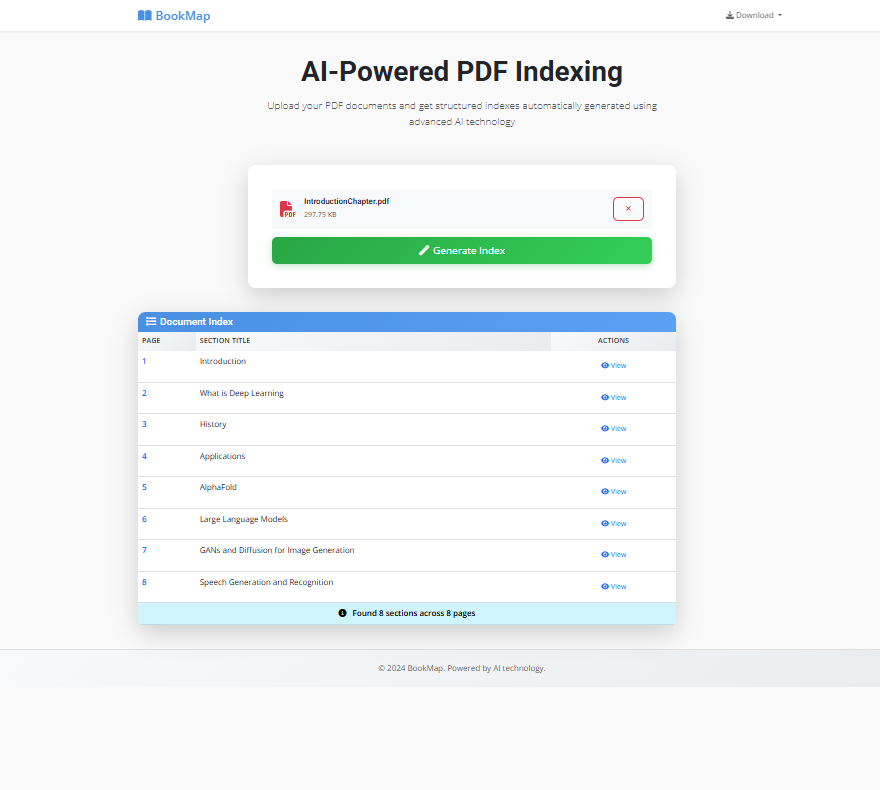

# BookMap Web Application

A modern web application for automatically indexing PDF documents using AI-powered document layout analysis and OCR technology.



## 🛠️ Technology Stack

- **Backend**: Flask (Python)
- **Frontend**: HTML5, CSS3, JavaScript (Bootstrap 5, jQuery)
- **AI Model**: YOLOv8X-doclaynet for document layout analysis
- **OCR**: Tesseract for text extraction
- **PDF Processing**: pdf2image with Poppler

## 📋 Prerequisites

Before running the application, you need to install the following dependencies:

### System Dependencies

#### Windows
```bash
# Install Poppler (required for PDF processing)
# Download from: https://github.com/oschwartz10612/poppler-windows/releases/
# Extract and add bin folder to PATH

# Install Tesseract OCR (optional, has fallback)
# Download from: https://github.com/UB-Mannheim/tesseract/wiki
# Install and add to PATH
```

#### macOS
```bash
brew install poppler tesseract
```

#### Linux (Ubuntu/Debian)
```bash
sudo apt update
sudo apt install poppler-utils tesseract-ocr
```

### Python Dependencies
- Python 3.8 or higher
- pip (Python package installer)

## 🚀 Quick Start

### 1. Clone the Repository
```bash
git clone https://github.com/pranavdhawann/BookMap.git
cd BookMap
```

### 2. Create Virtual Environment (Recommended)
```bash
# Create virtual environment
python -m venv venv

# Activate virtual environment
# Windows:
venv\Scripts\activate
# macOS/Linux:
source venv/bin/activate
```

### 3. Install Python Dependencies
```bash
pip install -r requirements.txt
```

### 4. Run the Application
```bash
python app.py
```

### 5. Open Your Browser
Navigate to `http://localhost:5000`

## 📁 Project Structure

```
BookMap/
├── app.py                      # Main Flask application
├── book_indexer_web_fixed.py   # AI processing engine
├── book_indexer_minimal.py     # Minimal version (fallback)
├── templates/
│   └── index.html             # Main web interface
├── static/
│   ├── style.css              # Custom styles
│   └── script.js              # Frontend JavaScript
├── requirements.txt            # Python dependencies
├── Input/                      # Sample PDF files
├── Output/                     # Generated results
└── README.md                   # This file
```

## 🔧 Configuration

The application automatically downloads the YOLOv8X-doclaynet model on first run. No additional configuration is required for basic usage.

### Environment Variables (Optional)
- `FLASK_DEBUG`: Set to `true` for development mode
- `PORT`: Port number for the application (default: 5000)

## 📄 License

This project is licensed under the MIT License - see the [LICENSE](LICENSE) file for details.

## 📞 Support

If you encounter any issues or have questions, please open an issue on GitHub or contact the maintainers.
